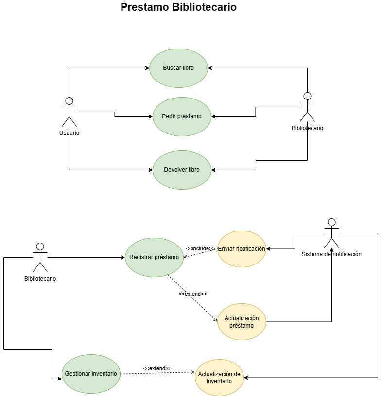

# biblioteca-prestamo

|  Actor |  XXX (USUARIO) |
|---|---|
| Descripción  | _Pide un servicio_  |
| Características  | _Solicita préstamos_ |
| Relaciones | _El bibliotecario tambien busca libros pide préstamo y devuelve libros_  |
| Referencias | _Busca un libro de interés, pide un préstamo al bibliotecario y finalmente devuelve el libro_ |   
|  Notas |  _Notas adicionales_ |
| Autor  | _materancode_ |
|Fecha | _04-04-2024_ |

|  Atributo |||
|---|---|---|
| _Usuario_  | _Préstamos_  | _Cliente_ |
| | |

|  Caso de Uso	CU | XXX Usuario  |
  |---|---|
  | Fuentes  | _Biblioteca y gestión de préstamos_  |
  | Actor  |  _Bibliotecario, Usuario y Sistema_ |
  | Descripción | _Registro de préstamos, concesión de libros y envio de notificaciones_  |
  | Flujo básico | _1.El usuario busca libro/ 2.El usuario pide préstamo/ 3.El bibliotecario lo concede/ 4.Finalizado el tiempo del préstamo el sistema envía una notificación_ |
  | Pre-condiciones | _El usuario debe estar interesado en un libro_  |  
  | Post-condiciones  | _El usuario visita la biblioteca_  |  
  |  Requerimientos | _El usuario debe registrarse_  |
  |  Notas |  _Se podrá extender el tiempo si es un usuario fiel_ |
  | Autor  | _materancode_ |
  |Fecha | _04-05-2020_ |
 

|  Actor |  XXX (Bibliotecario) |
|---|---|
| Descripción  | _Registra préstamos, gestiona stock, busca libros y devuelve libros_  |
| Características  | _El usuario le da un libro de interés, hace el registro del usuario y concede el préstamo por un tiempo determinado hasta que el sistema le envia una notificación_ |
| Relaciones | _El usuario tambien busca libros, pide préstamos y devuelve libros_  |
| Referencias |  |   
|  Notas |  |
| Autor  | _materancode_ |
|Fecha | _04-04-2024_ |

|  Atributo |||
|---|---|---|
| _Bibliotecario_  | _Registros_  | _Trabajador_ |
| | |

|  Caso de Uso	CU | XXX Bibliotecario  |
  |---|---|
  | Fuentes  | _Biblioteca y gestión de préstamos_  |
  | Actor  |  _Bibliotecario, Usuario y Sistema_ |
  | Descripción | _Registro de préstamos, concesión de libros y envio de notificaciones_  |
  | Flujo básico | _1.El bibliotecario registra un usuario / 2.El bibliotecario gestiona stock|
  | Pre-condiciones | _El bibliotecario_  |  
  | Post-condiciones  | _El bibliotecario debe tener un usuario que registrar_  |  
  |  Requerimientos | _Estar registrado en el sistema de gestión de la biblioteca_  |
  |  Notas |  |
  | Autor  | _materancode_ |
  |Fecha | _04-05-2020_ |

   

|  Actor |  XXX (Sistema) |
|---|---|
| Descripción  | _Almacena datos de usuarios y libros, envia notificaciones_  |
| Características  | _El bibliotecario hace el registro del usuario, el sistema lo almacena en la base de datos y luego envia las notificaciones pertinentes_ |
| Relaciones |   |
| Referencias |  |   
|  Notas |  |
| Autor  | _materancode_ |
|Fecha | _04-04-2024_ |

|  Atributo |||
|---|---|---|
| _Sistema_  | _Automatización_  | _Tareas_ |
| | |

|  Caso de Uso	CU | XXX Sistema  |
  |---|---|
  | Fuentes  | _Almacenamiento de los datos que facilite el bibliotecario_  |
  | Actor  |  _Bibliotecario, Usuario y Sistema_ |
  | Descripción | _Almacenamiento de datos y envio de notificaciones_  |
  | Flujo básico | |
  | Pre-condiciones |   |  
  | Post-condiciones  |   |  
  |  Requerimientos |   |
  |  Notas |  |
  | Autor  | _materancode_ |
  |Fecha | _04-05-2020_ |

   

